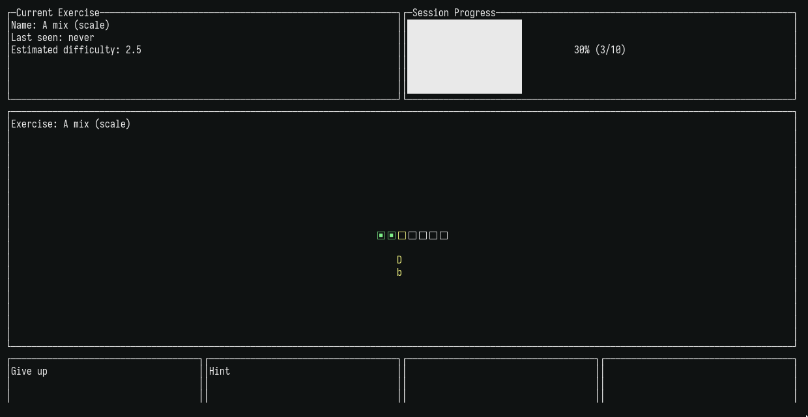
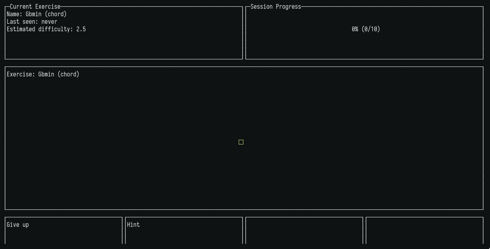

# Chordy

Chordy is a [spaced-repetition](https://en.wikipedia.org/wiki/Spaced_repetition) tool for learning
music theory. It requires a MIDI controller, and prompts the user to play certain chords and scales
at an interval designed to effectively store them into long-term memory.



## Features

* Contains many music theory exercises: notes, chords (major, minor, diminished...), and scales (major, minor, other modes) - with more to come
* Repeats exercises at intervals designed to improve long-term and muscle memory, using the [SM2 algorithm](https://www.supermemo.com/en/archives1990-2015/english/ol/sm2)
* Records the difficulty of each exercise and factors this into exercise spacing
* Supports most MIDI controllers via rtmidi

## Installation

You can either download a binary for Linux from the [releases page](https://github.com/kdelwat/chordy/releases/), or build Chordy yourself.

### Building

1. Install the [Go language](https://golang.org/) toolchain and `make`, following instructions for your OS
2. Clone this repository: `git clone https://github.com/kdelwat/chordy.git && cd chordy`
3. Build the `chordy` binary: `make`

## Usage

Before running the program, make sure your MIDI controller is connected.

After running `chordy`, you can play any note to start a session. During the session, the main area of the screen is filled with the current exercise.

Play the exercise on your controller to complete it. For example, the screenshot shows the "Gbmin" exercise, or G flat minor - playing
the notes G♭, A, and D♭ (the octave you play doesn't matter).



At the bottom of the screen is the pad controls - you can use the pads on your MIDI controller to perform these actions (see the configuration
section for more details). After completing an exercise, use the pads to select how hard it was for you to recall. This will affect how many days it
will be until the exercise is shown again.

You can exit Chordy at any time by pressing `q` or `Ctrl-C`. All progress is saved automatically.

### Configuration

Running the program for the first time will create a file at `$HOME/.config/chordy/config.json`, which looks like:

```
{
  "akey": "40",
  "bkey": "41",
  "ckey": "42",
  "dkey": "43",
  "databasepath": "/home/cadel/.data/chordy/db"
}
```

The `*key` parameters control which MIDI note is emitted by your pads - key A is the leftmost control in the bottom of the screen and so on.
You can modify this to suit your controller. The `databasepath` parameter specifies the location of the database used to store your progress.

## Caveats

I've tested this program using the Akai MPK Mini controller only. There could be bugs relating to other controllers - if so, please file an issue
and I'll try to help!

